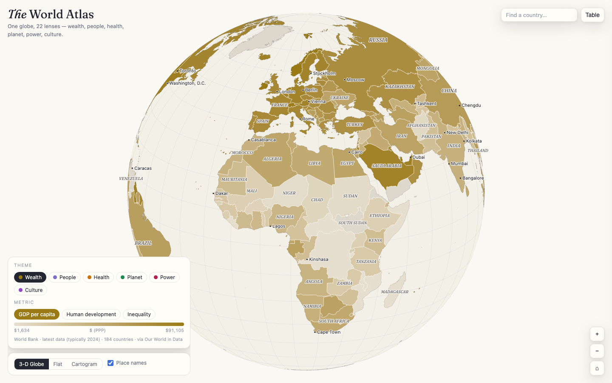

# 🗺️ The World Atlas

**Live: [the-world-atlas.vercel.app](https://the-world-atlas.vercel.app)**

One interactive globe, **27 lenses** on the world — wealth, people, health, planet, power, and culture. Every country colored by the metric you choose, with three ways to view it: a draggable 3-D globe, a flat map, and a population cartogram where each country is a circle sized by its population.



## The 27 lenses

| Theme | Metrics |
|---|---|
| **Wealth** | GDP per capita (PPP) · Human Development Index · Inequality (Gini) |
| **People** | Population density · Median age · Fertility rate · Urban population · Happiness · Literacy · Internet use |
| **Health** | Life expectancy · Obesity · Smoking · Electricity access |
| **Planet** | CO₂ emissions per capita · Renewable electricity · Forest cover |
| **Power** | Electoral democracy (V-Dem) · Corruption perception · Military spending |
| **Culture** | Meat consumption · Alcohol consumption |
| **Faith** | Majority religion · Christians % · Muslims % · Unaffiliated % · Hindus % (Pew Research 2020 — see the dedicated [Faiths of the World](https://faiths-of-the-world.vercel.app) map) |

## Features

- **Three views** — 3-D globe (drag, zoom to 16×), flat map, and a Dorling cartogram (circle area = population, color = selected metric)
- **Ranked tooltips** — hover any country: value + world rank
- **Country profile** — click a country for all 27 metrics at once, with percentile bars
- **Sortable table** per theme, **search** that flies to any country
- 7,000+ place names appearing progressively with zoom, light & dark theme, responsive to phone screens

## Data

All indicators via [Our World in Data](https://ourworldindata.org/), latest available year per country (typically 2020–2025). Original sources: World Bank, UN World Population Prospects, UNDP, WHO, UNESCO, ITU, Global Carbon Budget, Ember, FAO, V-Dem, Transparency International, SIPRI, World Happiness Report. Boundaries and place names from Natural Earth.

## Tech

Single self-contained HTML file — D3.js + topojson-client, Canvas 2D rendering with level-of-detail switching, no build step, no external requests at runtime. Works offline.

## Run locally

```bash
python3 -m http.server 8000   # open http://localhost:8000
```

## License

Code: MIT. Data: © respective sources via Our World in Data (CC BY). Boundaries: Natural Earth (public domain).
